# Awesome Enterprise Message Broker 🚀

  
  
  
  
  

A comprehensive, SEO-optimized curated list of top **SaaS Message Broker Platforms** and production-ready **Open-Source Distributed Messaging & Event Streaming Solutions**. Designed for platform engineers, backend developers, SREs, and enterprise architects evaluating modern asynchronous messaging middleware, pub/sub queues, and event-driven infrastructure.

---

## 📖 Table of Contents
- [☁️ SaaS / Hosted Message Broker Platforms](#-saas--hosted-message-broker-platforms)
- [🔓 Open-Source Message Brokers & Streaming Engines](#-open-source-message-brokers--streaming-engines)
- [🤝 How to Contribute](#-how-to-contribute)
- [⭐ Star History](#-star-history)
- [💖 Support & Sponsorship](#-support--sponsorship)
- [⚠️ Disclaimer](#%EF%B8%8F-disclaimer)

---

## ☁️ SaaS / Hosted Message Broker Platforms

> **📊 Market Size & Industry Dynamics**: The global enterprise message broker market is estimated at **~$15 Billion in 2026** and projected to reach **~$35 Billion by 2032**. The market structure is **moderately fragmented** — while **Amazon Web Services (AWS)** and **Microsoft Azure** hold dominant cloud queue footprints and **Apache Kafka** (via Confluent/managed services) leads event streaming, specialized enterprise solutions like **IBM MQ** and **Solace PubSub+** maintain deep penetration in regulated and high-frequency financial sectors. No single vendor exhibits a absolute winner-take-all monopoly; modern enterprises typically run hybrid multi-broker architectures.

Below is a comparison of leading SaaS message broker solutions, ordered by parent company scale (revenue / valuation descending):

| Platform | Description | Pricing (Starting Tier) | Free Tier / Trial Limits | Company Size (Revenue / Valuation) |
| :--- | :--- | :--- | :--- | :--- |
| **[Amazon SQS](https://aws.amazon.com/sqs/)** 📦 | Fully managed distributed message queuing service supporting standard and FIFO queues with high scalability. | **$0.40 per 1 million requests** (Standard Queue beyond free tier) | **1 Million requests/month** free forever (100,000 requests/month for FIFO) | **~$638 Billion revenue** (Amazon FY2025) |
| **[Google Cloud Pub/Sub](https://cloud.google.com/pubsub)** 🌐 | Global, fully managed asynchronous messaging service with guaranteed at-least-once or exactly-once delivery. | **$40.00 per TiB** ($0.04/GiB throughput after first 10 GiB) | **10 GiB/month** free throughput + **10 GiB/month** free message storage | **~$350 Billion revenue** (Alphabet FY2025) |
| **[Azure Service Bus](https://azure.microsoft.com/en-us/products/service-bus/)** 🔷 | Fully managed enterprise integration message broker supporting queues, publish/subscribe topics, and subscriptions. | **$0.05 per 1 million operations** + **$0.0135/hour** base charge (Standard Tier) | **$200 free credit** for 30 days via Azure Free Account (No perpetual free tier) | **~$281 Billion revenue** (Microsoft FY2025) |
| **[IBM MQ](https://www.ibm.com/products/mq)** 🏢 | Enterprise-grade messaging middleware powering mission-critical transactional messaging across cloud and mainframes. | **$0.08 per VPC-hour** (IBM MQ on Cloud reserved/pay-as-you-go starting rate) | **30-day free trial** with full enterprise capability access | **~$63 Billion revenue** (IBM FY2025) |
| **[Redis Cloud Pub/Sub](https://redis.io/)** ⚡ | High-throughput, in-memory pub/sub engine providing sub-millisecond latency for real-time messaging workloads. | **$5.00/month** (Paid Fixed Tier for 250 MB memory) | **30 MB memory** free forever (Includes 30 concurrent connections & 5 GB transfer) | **~$2 Billion valuation** (Estimated private valuation) |
| **[Solace PubSub+ Cloud](https://solace.com/)** 🕸️ | Complete event mesh platform unifying pub/sub, queuing, and event streaming across hybrid and multi-cloud environments. | **$280.00/month** (PubSub+ Cloud Developer / Standard Service instance) | **90-day free trial** with up to 100 concurrent connections | **~$80 Million revenue** (Private entity; 21.5% YoY messaging growth) |

---

## 🔓 Open-Source Message Brokers & Streaming Engines

The open-source message broker ecosystem offers production-proven reliability, open standards, and high throughput. Below are top open-source projects sorted by GitHub stars count descending:

| Project | Description | GitHub Stars |
| :--- | :--- | :--- |
| **[Apache Kafka](https://github.com/apache/kafka)** 🐘 | Distributed event streaming platform capable of handling trillions of events a day with log append storage and stream processing APIs. |  |
| **[RabbitMQ](https://github.com/rabbitmq/rabbitmq-server)** 🐇 | Highly flexible, Erlang-based message broker supporting AMQP 1.0, MQTT, and STOMP with complex routing topology. |  |
| **[NATS Server](https://github.com/nats-io/nats-server)** ⚡ | Cloud-native, high-performance messaging system designed for microservices, IoT, and edge computing with JetStream persistence. |  |
| **[Apache Pulsar](https://github.com/apache/pulsar)** 🌌 | Cloud-native, multi-tenant distributed messaging and streaming platform featuring decoupled compute (Pulsar) and storage (BookKeeper). |  |
| **[ZeroMQ / libzmq](https://github.com/zeromq/libzmq)** 🔌 | High-performance asynchronous messaging library providing sockets that carry atomic messages across in-process, IPC, and TCP. |  |
| **[Apache RocketMQ](https://github.com/apache/rocketmq)** 🚀 | Financial-grade distributed messaging and streaming data platform optimized for low-latency, massive topic concurrency. |  |
| **[Redpanda](https://github.com/redpanda-data/redpanda)** 🐼 | C++ based, Kafka-compatible event streaming platform engineered for low latency, zero JVM dependencies, and Jepsen-verified safety. |  |
| **[NSQ](https://github.com/nsqio/nsq)** 📬 | Real-time distributed messaging platform in Go engineered to operate at scale without single points of failure. |  |
| **[Apache ActiveMQ Artemis](https://github.com/apache/activemq-artemis)** 🎯 | High-performance non-blocking message broker offering multi-protocol support (AMQP, MQTT, STOMP, OpenWire) and high availability. |  |
| **[Apache ActiveMQ Classic](https://github.com/apache/activemq)** 🏛️ | The original open-source Java-based enterprise message broker supporting JMS 1.1 / 2.0 and enterprise integration patterns. |  |

---

## 🤝 How to Contribute
Contributions are warmly welcomed! Help build the ultimate resource for enterprise messaging infrastructure. 🌟

1. Fork this repository. 🍴
2. Create a feature branch (`git checkout -b add-new-broker`).
3. Add or update entries with factual information, clear descriptions, and official links.
4. Submit a Pull Request with a clear description of your changes.

Check out our curated list directory at [Awesome-Awesome-Awesome](https://github.com/ishandutta2007/Awesome-Awesome-Awesome)!

---

## ⭐ Star History

---

## 💖 Support & Sponsorship

Thank you for visiting and using **Awesome-Enterprise-Message-Broker**! If you find this project helpful, please consider supporting it:

- ⭐ **Star** this repository to increase visibility!
- 🔀 **Fork** and contribute to keep the project active and up to date!
- 📢 **Share** with your fellow engineers, SREs, and DevOps community!

☕ **Buy me a coffee / Sponsor the Maintainer**:  

---

## ⚠️ Disclaimer
- This repository is a **community-curated index** provided for informational and comparative purposes only.
- All product names, logos, trademarks, and registered trademarks belong to their respective owners.
- Pricing figures and feature sets are verified periodically but may change without notice. Always check official product documentation before making procurement decisions.
